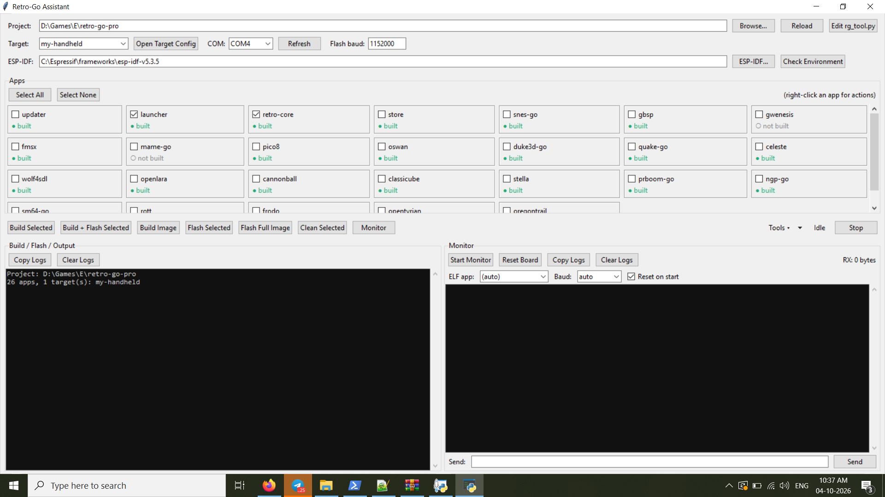

# Retro-Go Assistant

A Windows GUI for [Retro-Go](https://github.com/ducalex/retro-go)'s `rg_tool.py`. Build, flash and monitor your ESP32 handheld from one window, with no ESP-IDF terminal and no typing commands.



It is a **frontend, not a replacement**: every build, image, flash and clean operation is delegated to your project's own `rg_tool.py`. It never modifies ESP-IDF. Made for [retro-go-pro](https://github.com/pcgamer404/retro-go-pro), but it works with any Retro-Go project.

## Features

**Project and discovery**
- Auto-detects the project: next to `rg_tool.py`, in a subfolder such as `tools/`, the last-used project, or a folder picker
- Apps are read from `PROJECT_APPS` in `rg_tool.py` and targets from `components/retro-go/targets/*/config.h`. Nothing is hard-coded, so 3 apps or 50 all work
- **Reload** rescans after you add an app or target
- **Tools** menu: Edit `rg_tool.py`, Open target config, launcher and .exe builders
- Remembers project, ESP-IDF path, target, COM port, bauds and selected apps (`%USERPROFILE%\.retrogo_assistant.json`)

**Build and flash**
- Two clearly separated button groups:
  - **BIN** (update apps already on the device): Build, Flash, Build + Flash (stops if the build fails), Clean, all acting on the selected apps. Fast, but it can only replace existing apps, because the partition table is not changed.
  - **IMG** (full install, needed to add a new core or port): Build Image, **Erase + Flash Image**. Erases the whole flash (with a confirmation prompt), then flashes the full image. Untick **Erase flash first** to flash the image without erasing.
- Scrolling app grid with "built / not built" status
- Right-click an app: Open Folder / Build Folder / `CMakeLists.txt` / `sdkconfig`, Edit `rg_tool.py`, Build, Build + Flash, Flash, Clean, Monitor
- Target selector, COM port list with refresh, separate flash baud
- Stop button kills the running task and its child processes
- Hover any action button for a short explanation of what it does
- All output is captured in the left log, with no stray console windows (Copy / Clear)

**Built-in serial monitor** (right column)
- Captures the full log from reset: **Reset on start** opens the port, resets the board and records the boot log
- **Auto baud detection**, or pick a fixed baud
- Crash decoding: backtrace and `PC` addresses are resolved against the ELF of the app you choose
- Reset Board, Send box, live RX byte counter, Copy / Clear
- Reconnects if the port drops during a reset, and pauses itself while flashing

**ESP-IDF handling**
- Finds ESP-IDF automatically or via **ESP-IDF...**
- Uses ESP-IDF's own Python environment and never silently falls back to the system Python
- Merges the ESP-IDF environment with your normal PATH, so `git` and other tools keep working
- **Check Environment** reports Python, Git, CMake, Ninja, `idf.py`, `esp_idf_monitor` and `esptool`

## Requirements
- Windows with ESP-IDF installed (tested with ESP-IDF 5.3.x from the Espressif installer)
- Python 3 with Tk (the standard python.org installer includes it)
- A Retro-Go project containing `rg_tool.py`

## Install and run
1. Copy `retro_go_assistant.py` into your Retro-Go project folder, next to `rg_tool.py`.
2. Run `python retro_go_assistant.py`.
3. Optional: **Tools > Create run_assistant.bat** gives a double-click launcher with no console window.

## Build the .exe (optional)
No Python needed afterwards on the machine that runs it.

**From the app:** **Tools > Build standalone .exe**. This installs PyInstaller (internet needed once) and writes `dist\RetroGoAssistant.exe`. Progress shows in the left log.

**Manually:**
```bat
pip install pyinstaller
python -m PyInstaller --onefile --windowed --name RetroGoAssistant retro_go_assistant.py
```

Copy `RetroGoAssistant.exe` next to `rg_tool.py` so the project is auto-detected. Elsewhere, use **Browse...** once and it remembers. It still needs ESP-IDF installed.

## Usage
1. Check the project, target, COM port and ESP-IDF path at the top, then click **Check Environment** once.
2. Tick the apps you want. Updating apps already on the device: use the **BIN** buttons. Adding a new core or port: use **Build Image**, then **Erase + Flash Image**.
3. Click **Start Monitor** on the right to see the boot log and crashes.

## What each button runs
| Button | Command |
|---|---|
| Build | `rg_tool.py build <apps> --target <t>` |
| Flash | `rg_tool.py flash <apps> --target <t> --port <p> --baud <b>` |
| Build Image | `rg_tool.py build-img <apps> --target <t>` |
| Erase + Flash Image | `esptool erase_flash --port <p> --baud <b>`, then `rg_tool.py install <apps> --target <t> --port <p> --baud <b>` |
| Clean | `rg_tool.py clean <apps> --target <t>` |

## Troubleshooting
- **Monitor shows nothing:** watch the RX counter. At 0, check the COM port and press Reset Board. If it climbs but the text is garbled, pick the baud manually (the flash baud is usually not the console baud).
- **Flash says the port is busy:** another program has the COM port open.
- **`rg_tool.py` rejects an argument:** the command lines are built in the `rg()` method, so adjust them there.
